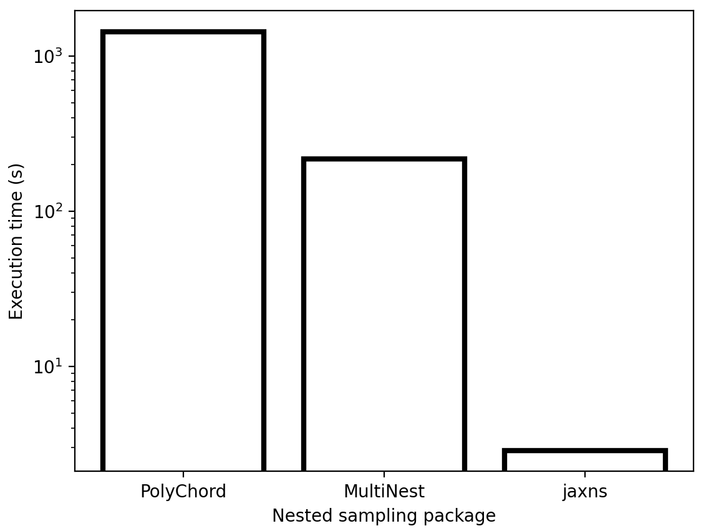

# What is it?
Enables probabilistic programming using nested sampling. It's coded in JAX in a manner that allows lowering the entire inference algorithm to XLA primitives, which are JIT-compiled for high performance. 

JAXNS provides a constrained likelihood sampler which combines and modifies ideas from MultiNest (F. Feroz et al. 2008; https://arxiv.org/pdf/0809.3437.pdf) and PolyChord (W.J. Handley et al. 2015; https://arxiv.org/abs/1506.00171).
In particular we perform a sequence of 1D slice sampling with a step-out procedure (https://projecteuclid.org/euclid.aos/1056562461), using clustering to initialise the step-out procedure at each step.

Comparison with PolyChord:
1. We choose slice directions by randomly choosing a unit-vector, rather than randomly sampling a random-orthogonal basis and slicing along each dimension. We find that this improves the efficiency of exploring the space, such that we get accurate evidence calculations often with just one or two times the number of dimension slices (What polychord calls `num_repeats`)
2. We uniformly select an initial sampling point, rather than first a mode proportional to the local volume and then uniformly within that mode. We found that the random-walk behaviour mentioned in (W.J. Handley et al. 2015) is also present when you try to estimate the local volume. In fact, we found that by uniformly sampling a starting point, and taking into account the tunneling between modes, the modes are actually quite stable. The cluster death mentioned in their paper, is more likely due to having too few live points.
3. We do not directly perform whitening, but rather determine the initial step-out size (`w` in their paper) by finding the points of intersection of the slice ray with a bounding ellipsoid, which is provided by the clustering process.
4. We do not keep phantom points. Doing so would be difficult given the static memory requirements of XLA, and we do not have a use for them. In principle, we could use them to perform rank-1 updates of the ellipsoidal parameters of each cluster during the sampling, however the increase in computational complexity doesn't warrant the improvement.

Comparison with MultiNest:
1. We use hierarchical ellipsoidal clustering, similar to the method presented in (F. Feroz et al. 2008).
2. In order to allow JIT compiling, the ellipsoidal clustering algorithm was redesigned as an iterative algorithm with fixed maximum depth. So the user must specify how many splits are possible using a `depth` parameter. The maximum number of clusters is then `2^(depth-1)`.
3. We also modify the splitting part of the cluster algorithm to be iterative. That is, when determining the reassignment of points, we only reassign the single point that will reduce the clustering cost the most, rather than reassigning all points at each step. In principle, because we initialise each clustering with a vanilla k-means split there are only a few reassignment iterations required. We did this because we had noticed that the clustering can be quite suboptimal when all points are reassignment at once.
4. We decide to perform reclustering by keeping track of an exponential moving average of the number of likelihood evaluations used in each sampling step. When this number is exceeded by `2*ndims` (equivalent to an extra step-out and shrink per dimension) we recluster. Due to the  rather flat efficiency curve of slice sampling the moving average is fairly stationary, and this is a good signal for reclustering.

# Install
Make sure you have JAX and the usual suspects with `pip install jax jaxlib numpy matplotlib scipy`. 
Install with `python setup.py install` or `pip install git+http://github.com/Joshuaalbert/jaxns.git`.

# Quick start

JAXNS is really fast because it uses JAX. I've found it's 2-4 orders of magnitude faster than other nested sampling packages.
The caveat is that you should define your likelihood function with JAX. This is no big deal because JAX is just a replacement for numpy. 
If you're unfamiliar, take a quick tour of JAX (https://jax.readthedocs.io/en/latest/notebooks/quickstart.html).
See more examples in `jaxns/examples`.

```python
from jaxns.nested_sampling import NestedSampler
from jaxns.prior_transforms import PriorChain, UniformPrior
from jaxns.plotting import plot_cornerplot, plot_diagnostics
from jax.scipy.linalg import solve_triangular
from jax import random, jit, disable_jit
from jax import numpy as jnp
import pylab as plt

ndims = 2

# define highly correlated data
data_mu = jnp.ones(ndims)
data_cov = jnp.diag(jnp.ones(ndims)) ** 2
data_cov = jnp.where(data_cov == 0., 0.95, data_cov)


# define prior which is a diagonal MVN
prior_mu = 2 * jnp.ones(ndims)
prior_cov = jnp.diag(jnp.ones(ndims)) ** 2
# "push" on each prior
prior_chain = PriorChain().push(MVNDiagPrior('x', prior_mu, jnp.sqrt(jnp.diag(prior_cov))))

# ground truth is analytic for comparison
true_logZ = log_normal(data_mu, prior_mu, prior_cov + data_cov)

post_mu = prior_cov @ jnp.linalg.inv(prior_cov + data_cov) @ data_mu + data_cov @ jnp.linalg.inv(
    prior_cov + data_cov) @ prior_mu
post_cov = prior_cov @ jnp.linalg.inv(prior_cov + data_cov) @ data_cov

# define the likelihood (note you need the include **unused_kwargs to consume unused dummy variables)
# The variable "x" will be passed in from the prior chain defined above.

def log_normal(x, mean, cov):
    L = jnp.linalg.cholesky(cov)
    dx = x - mean
    dx = solve_triangular(L, dx, lower=True)
    return -0.5 * x.size * jnp.log(2. * jnp.pi) - jnp.sum(jnp.log(jnp.diag(L))) \
           - 0.5 * dx @ dx
  
log_likelihood = lambda x, **unused_kwargs: log_normal(x, data_mu, data_cov)

# define the sampler you want to use.
ns = NestedSampler(log_likelihood, prior_chain, sampler_name='slice')

# run with options
results = ns(key=random.PRNGKey(0),
                  num_live_points=300,
                  max_samples=1e5,
                  collect_samples=True,
                  termination_frac=0.01,
                  stoachastic_uncertainty=False)

plot_diagnostics(results)
plot_cornerplot(results)

print("True logZ={} | calculated logZ = {:.2f} +- {:.2f}".format(true_logZ, results.logZ, results.logZerr))
print("True posterior m={}\nCov={}".format(post_mu, post_cov))
```

# Speed test comparison with other nested sampling packages

Let's compare JAXNS to some other nested sampling packages. 
You can do this on a simple standard problem of computing the evidence of an `ndims`-dimensional multivariate Gaussian likelihood with a uniform prior.
Specifically, the model is,
```
ndims=30
sigma=0.1
theta ~ U[-jnp.ones(ndims),jnp.ones(ndims)]
def log_likelihood(theta, **kwargs):
    r2 = jnp.sum(theta ** 2)
    logL = -0.5 * jnp.log(2. * jnp.pi * sigma ** 2) * ndims
    logL += -0.5 * r2 / sigma ** 2
    return logL
```
We use 1000 live points.

The packages we compare JAXNS against on this simple problem are:
1. https://github.com/joshspeagle/dynesty
2. https://github.com/PolyChord/PolyChordLite
3. https://johannesbuchner.github.io/PyMultiNest/

To install these packages, follow the directions on those websites. For PolyChord and MultiNest, you'll need to build the samplers from source as well as install the python interfaces. Dynesty is pure python and can be installed with `pip`.
The speed test comparison code can be found in `./jaxns/examples/compare_with_other_nested_sampling_packages.py`.
Note, that dynesty took 1:45 hours and so I excluded it when making this plot.


