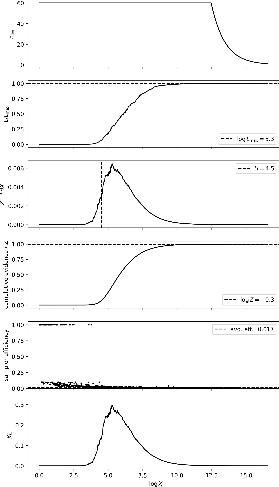
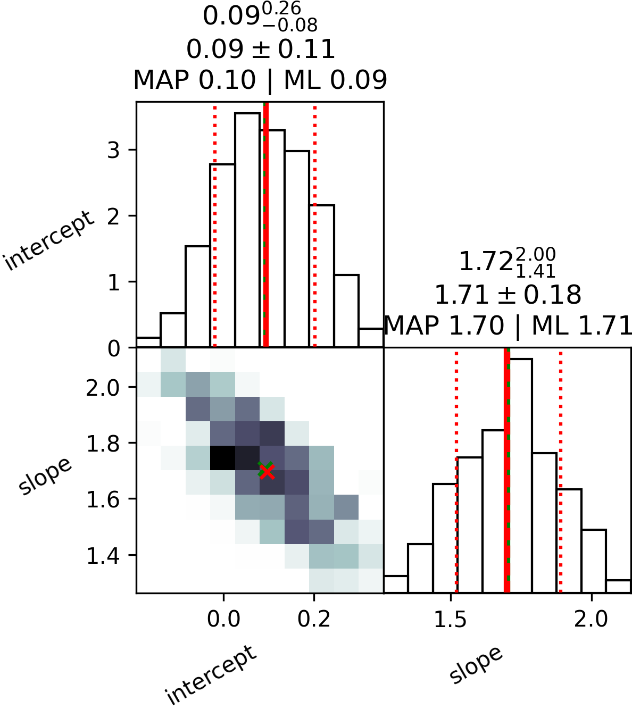
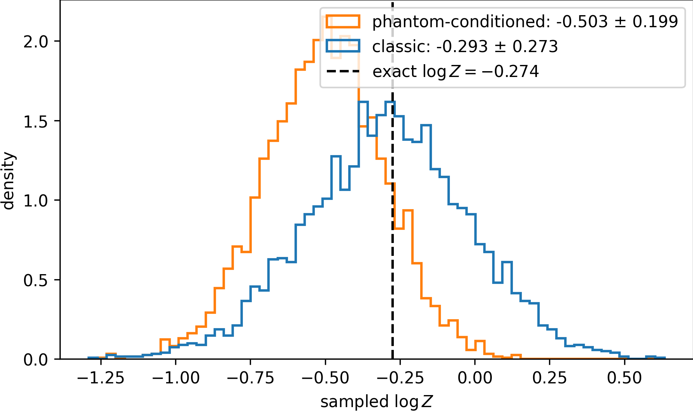

[](https://badge.fury.io/py/jaxns)
[](https://badge.fury.io/py/jaxns)
[](https://jaxns.readthedocs.io/en/latest/?badge=latest)

Main: 

Develop: 


## Mission: _To make nested sampling **faster, easier, and more powerful**_

# What is JAXNS?

JAXNS is a nested-sampling library and probabilistic programming interface built
with JAX. It is intended for scientific problems that need Bayesian evidence,
weighted posterior samples, or exploration of difficult constrained priors.

JAXNS v3 implements nested sampling as a race tree with dynamic lineage
allocation.

JAXNS can:

1. Estimate the Bayesian evidence of a model or hypothesis.
2. Produce weighted or resampled posterior samples.
3. Explore degenerate, multimodal posteriors.
4. Model continuous and discrete variables.
5. Scale from a laptop to a cluster of thousands of accelerators.

The original JAXNS paper is available on
[arXiv](https://arxiv.org/abs/2012.15286), as is the paper on
[phantom-powered nested sampling](https://arxiv.org/abs/2312.11330).

# Install

JAXNS requires Python 3.10 or later. Install the default package from PyPI:

```bash
pip install jaxns
```

The distributed runtime has two additional dependencies and is opt-in:

```bash
pip install "jaxns[distributed]"
```

For development, clone the repository and install the test and example extras:

```bash
git clone https://www.github.com/JoshuaAlbert/jaxns.git
cd jaxns
pip install -e ".[tests,examples]"
```

# Quick start

## Define a model with JAXCTX

Define Bayesian variables with `Prior(...).realise()`, return a scalar log
likelihood, and pass observations or other runtime data through `args`.

```python
import jax
from jax import numpy as jnp
from jaxctx.priors.prior import Prior
from tensorflow_probability.substrates import jax as tfp

from jaxns.model import Model

tfpd = tfp.distributions


def prior_model(predictor, observations, measurement_uncertainty):
    intercept = Prior(
        tfpd.Normal(loc=0.0, scale=1.0),
        name="intercept",
    ).realise()
    slope = Prior(
        tfpd.Normal(loc=0.0, scale=2.0),
        name="slope",
    ).realise()
    prediction = intercept + slope * predictor
    return jnp.sum(
        tfpd.Normal(
            loc=prediction,
            scale=measurement_uncertainty,
        ).log_prob(observations)
    )


model = Model(prior_model=prior_model)
args = (
    jnp.linspace(0.0, 1.0, 6),
    jnp.asarray([0.15, 0.32, 0.83, 1.08, 1.52, 1.77]),
    jnp.asarray(0.15),
)
model.sanity_check(
    key=jax.random.PRNGKey(1),
    args=args,
)
```

The model exposes the same explicit `args` and `params` on its lower-level
operations, including `sample_U`, `transform_to_X`, `log_likelihood`,
`log_prior`, and `log_joint`.

## Declare continuous periodic parameters

Use `realise(periodic=True)` when the two endpoints of a continuous prior's
base coordinate represent the same physical point. For example, an angular
location can cross the `-pi`/`pi` chart seam:

```python
def angular_model(observed_angle, concentration):
    angle = Prior(
        tfpd.Uniform(low=-jnp.pi, high=jnp.pi),
        name="angle",
    ).realise(periodic=True)
    return concentration * jnp.cos(angle - observed_angle)
```

This is an endpoint-equivalence assertion, not a synonym for a bounded prior.
JAXNS keeps canonical samples in the half-open unit cube and draws an
independent random chart for every isotropic slice transition, allowing the
chain to move across an artificial seam without changing the prior measure.
The declaration applies to the complete realised prior; cyclic categorical
variables are not supported.

Periodic coordinates currently require isotropic slice directions. Combining
them with `EllipsoidalDirection` fails during sampler construction because the
Euclidean GMM can split a seam-crossing mode; toroidal GMM geometry is tracked
in [issue #276](https://github.com/Joshuaalbert/jaxns/issues/276). The
[Jones-scalar example](docs/examples/Jones_scalar_modelling.ipynb) demonstrates
a periodic calibration phase together with DTEC, clock, and unknown noise.

## Run nested sampling locally

```python
from jaxns.core import NestedSampler

sampler = NestedSampler(
    model=model,
    args=args,
    collect_phantom_samples=True,
    max_phantom_samples=2,
)
state = sampler.run(key=jax.random.PRNGKey(6))
results = state.to_result().trim()

results.summary()
results.plot_diagnostics()
results.plot_cornerplot(variables=["intercept", "slope"])
results.plot_evidence(
    num_samples=4096,
    conditionings=("classic", "phantom"),
    key=jax.random.PRNGKey(3),
    exact_log_Z=-0.274366,
)

# Reuse the same retained clusters with a shorter conditioning prefix.
prefix_evidence = results.sample_evidence_mc(
    num_samples=4096,
    conditioning="phantom",
    num_phantoms=1,
    key=jax.random.PRNGKey(4),
)
```

Phantom collection and evidence conditioning are separate choices. The
sampler retains the first `max_phantom_samples` eligible transitions from each
chain and always reserves the final transition for the classic replacement.
Omitting the bound keeps one model dimension of phantom states by default.
At evidence time, `num_phantoms=None` uses every retained state; an explicit
value uses that many states from the same start prefix without rerunning nested
sampling. Retaining more states increases result/checkpoint memory, while a
shorter evidence prefix is physically sliced before JAX compilation so its
unused suffix adds no MC-kernel work.

A fixed-seed CPU run of the example above produces this summary:

```text
--------
Termination Conditions:
Small remaining evidence
--------
likelihood evals: 50435
classic samples: 818
phantom samples: 1516
likelihood evals / sample: 61.7
--------
logZ (classic expected)=-0.38 +- 0.28
max(logL)=5.31
H=4.74
posterior ESS (Kish)=109.5
likelihood evals / posterior ESS: 460.8
--------
intercept: mean +- std.dev. | MAP est. | max(L) est.
intercept: 0.09 +- 0.11 | 0.1 | 0.09
--------
slope: mean +- std.dev. | MAP est. | max(L) est.
slope: 1.69 +- 0.17 | 1.69 | 1.71
--------
```

| Nested-sampling diagnostics | Posterior corner plot |
|:---:|:---:|
|  |  |



The plots show the posterior geometry, sampler diagnostics, and both evidence
conditioning modes. Across 30 independent runs, phantom conditioning was
calibrated against the analytic evidence and reduced RMSE from 0.297 to 0.232.

Custom stopping goals, resumable checkpoints, posterior resampling, and
advanced sampler options are covered in the
[documentation](https://jaxns.readthedocs.io/en/latest/) and
[examples](docs/examples).

# Scale out

For expensive likelihoods, JAXNS can use a dynamic pool of CPU, GPU, and TPU
workers across one machine or a trusted cluster. Workers can join, leave, or
recover without restarting the scientific run.

See the executable [run-pattern design](docs/design/interface/run_pattern.py)
for setup, configuration, recovery, and checkpoint examples.

# Documentation and support

Read the [JAXNS documentation](https://jaxns.readthedocs.io/en/latest/) and the
[repository examples](docs/examples). Likelihood and prior-model calculations
must use JAX-compatible operations.

For scientific questions, use the
[GitHub discussion forum](https://github.com/JoshuaAlbert/jaxns/discussions).
Bug reports and contributions are welcome through GitHub issues and pull
requests.

# Change Log

26 Aug, 2026 -- JAXNS 3.0.0. Major paper-driven core and public API update:

- Added race-tree nested sampling with dynamic lineage allocation, a Python
  user-goal loop, JIT-compiled depth epochs, and continuation-batched
  likelihood evaluation across replacement chains.
- Added opt-in, hourly full-state checkpoints with automatic local and
  distributed resume, atomic manifest publication, and corruption detection.
- Made model data and parameters explicit through JAXCTX `args` and `params`,
  and made scientific state and result objects immutable pytree dataclasses.
- Added plateau-correct shrinkage and bounded final Monte Carlo evidence draws,
  with explicit classic or phantom conditioning using retained early-chain
  phantom states.
- Added opt-in warm-refined ellipsoidal slice directions and transparent
  finite or explicitly unlimited sample-buffer growth.
- Added reversible random-chart slice sampling for continuous periodic prior
  coordinates declared with JAXCTX `realise(periodic=True)`; isotropic
  directions are required until toroidal GMM geometry is available.
- Added an opt-in asynchronous worker runtime and `jaxns-cli` for local IPC or
  trusted-network multi-node TCP pools with dynamic registration, restartable
  heartbeat leases, worker-only likelihood execution, scalar logical-thread
  dispatch, and device-local continuation batching.
- Removed v2-only APIs, including evidence maximisation. Public v3 classes are
  imported from their defining modules.

3 Aug, 2025 -- JAXNS 2.6.9 released. Fix sdist, and TFP dependency.

7 Dec, 2024 -- JAXNS 2.6.7 released. Fix pip dependencies install.

13 Nov, 2024 -- JAXNS 2.6.6 released. Minor improvements to plotting.

9 Nov, 2024 -- JAXNS 2.6.5 released. Added gradient guided nested sampling. Removed `num_parallel_workers` in favour
`devices`.

4 Nov, 2024 -- JAXNS 2.6.4 released. Resolved bias when using phantom points.

1 Oct, 2024 -- JAXNS 2.6.3 released. Enable pytrees in context.

25 Sep, 2024 -- JAXNS 2.6.2 released. Fixed some important (not so edge) cases. Made faster. Handle no seed scenarios.

24 Sep, 2024 -- JAXNS 2.6.1 released. Sharded parallel JAXNS. Rewrite of internals to support sharded parallelisation.

20 Aug, 2024 -- JAXNS 2.6.0 released. Removed haiku dependency. Implemented our own
context. `jaxns.framework.context.convert_external_params` enables interfacing with any external NN libary.

24 Jul, 2024 -- JAXNS 2.5.3 released. Replacing framework U-space with W-space. Maintained external API in U space.

23 Jul, 2024 -- JAXNS 2.5.2 released. Added explicit density prior. Sped up parametrisation. Scan associative
implemented.

27 May, 2024 -- JAXS 2.5.1 released. Fixed minor accuracy degradation introduced in 2.4.13.

15 May, 2024 -- JAXNS 2.5.0 released. Added ability to handle non-JAX likelihoods, e.g. if you have a simulation
framework with python bindings you can now use it for likelihoods in JAXNS. Small performance improvements.

22 Apr, 2024 -- JAXNS 2.4.13 released. Fixes bug where slice sampling not invariant to monotonic transforms of
likelihood.

20 Mar, 2024 -- JAXNS 2.4.12 released. Minor bug fixes, and readability improvements. Added Empirical special prior.

5 Mar, 2024 -- JAXNS 2.4.11/b released. Add `random_init` to parametrised variables. Enable special priors to be
parametrised.

23 Feb, 2024 -- JAXNS 2.4.10 released. Hotfix for import error.

21 Feb, 2024 -- JAXNS 2.4.9 released. Minor improvements to some priors, and bug fixes.

31 Jan, 2024 -- JAXNS 2.4.8 released. Improved global optimisation performance using gradient slicing.
Improved evidence maximisation.

25 Jan, 2024 -- JAXNS 2.4.6/7 released. Added logging. Use L-BFGS for Evidence Maximisation M-step. Fix bug in finetune.

24 Jan, 2024 -- JAXNS 2.4.5 released. Gradient based finetuning global optimisation using L-BFGS. Added ability to
simulate prior models without bulding model (for data generation.)

15 Jan, 2024 -- JAXNS 2.4.4 released. Fix performance issue for larger `max_samples`. Fixed bug in termination
conditions. Improved parallel performance.

10 Jan, 2024 -- JAXNS 2.4.2/3 released. Another performance boost, and experimental global optimiser.

9 Jan, 2024 -- JAXNS 2.4.1 released. Improve performance slightly for larger `max_samples`, still a performance issue.

8 Jan, 2024 -- JAXNS 2.4.0 released. Python 3.9+ becomes supported. Migrate parametrised models to stable.
All models are now default able to be parametrised, so you can use hk.Parameter anywhere in the model.

21 Dec, 2023 -- JAXNS 2.3.4 released. Correction for ESS and logZ uncert. `parameter_estimation` mode.

20 Dec, 2023 -- JAXNS 2.3.2/3 released. Improved default parameters. `difficult_model` mode. Improve plotting.

18 Dec, 2023 -- JAXNS 2.3.1 released. Paper open science release. Default parameters from paper.

11 Dec, 2023 -- JAXNS 2.3.0 released. Release of Phantom-Powered Nested Sampling algorithm.

5 Oct, 2023 -- JAXNS 2.2.6 released. Minor update to evidence maximisation.

3 Oct, 2023 -- JAXNS 2.2.5 released. Parametrised priors, and evidence maximisation added.

24 Sept, 2023 -- JAXNS 2.2.4 released. Add marginalising from saved U samples.

28 July, 2023 -- JAXNS 2.2.3 released. Bug fix for singular priors.

26 June, 2023 -- JAXNS 2.2.1 released. Multi-ellipsoidal sampler added back in. Adaptive refinement disabled, as a bias
has been detected in it.

15 June, 2023 -- JAXNS 2.2.0 released. Added support to allow TFP bijectors to defined transformed distributions. Other
minor improvements.

15 April, 2023 -- JAXNS 2.1.0 released. pmap used on outer-most loops allowing efficient device-device communication
during parallel runs.

8 March, 2023 -- JAXNS 2.0.1 released. Changed how we're doing annotations to support python 3.8 again.

3 January, 2023 -- JAXNS 2.0 released. Complete overhaul of components. New way to build models.

5 August, 2022 -- JAXNS 1.1.1 released. Pytree shaped priors.

2 June, 2022 -- JAXNS 1.1.0 released. Dynamic sampling takes advantage of adaptive refinement. Parallelisation. Bayesian
opt and global opt modules.

30 May, 2022 -- JAXNS 1.0.1 released. Improvements to speed, parallelisation, and structure of code.

9 April, 2022 -- JAXNS 1.0.0 released. Parallel sampling, dynamic search, and adaptive refinement. Global optimiser
released.

2 Jun, 2021 -- JAXNS 0.0.7 released.

13 May, 2021 -- JAXNS 0.0.6 released.

8 Mar, 2021 -- JAXNS 0.0.5 released.

8 Mar, 2021 -- JAXNS 0.0.4 released.

7 Mar, 2021 -- JAXNS 0.0.3 released.

28 Feb, 2021 -- JAXNS 0.0.2 released.

28 Feb, 2021 -- JAXNS 0.0.1 released.

1 January, 2021 -- Paper submitted

## Star History

<a href="https://star-history.com/#joshuaalbert/jaxns&Date">
  <picture>
    <source media="(prefers-color-scheme: dark)" srcset="https://api.star-history.com/svg?repos=joshuaalbert/jaxns&type=Date&theme=dark" />
    <source media="(prefers-color-scheme: light)" srcset="https://api.star-history.com/svg?repos=joshuaalbert/jaxns&type=Date" />
    
  </picture>
</a>
