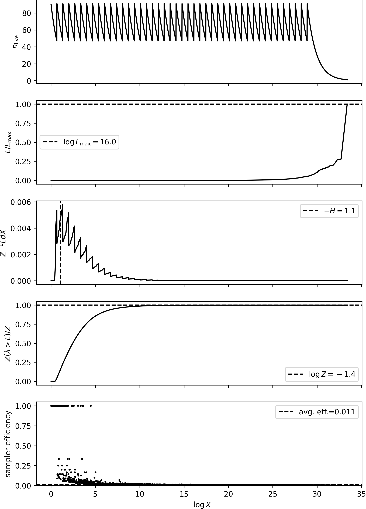
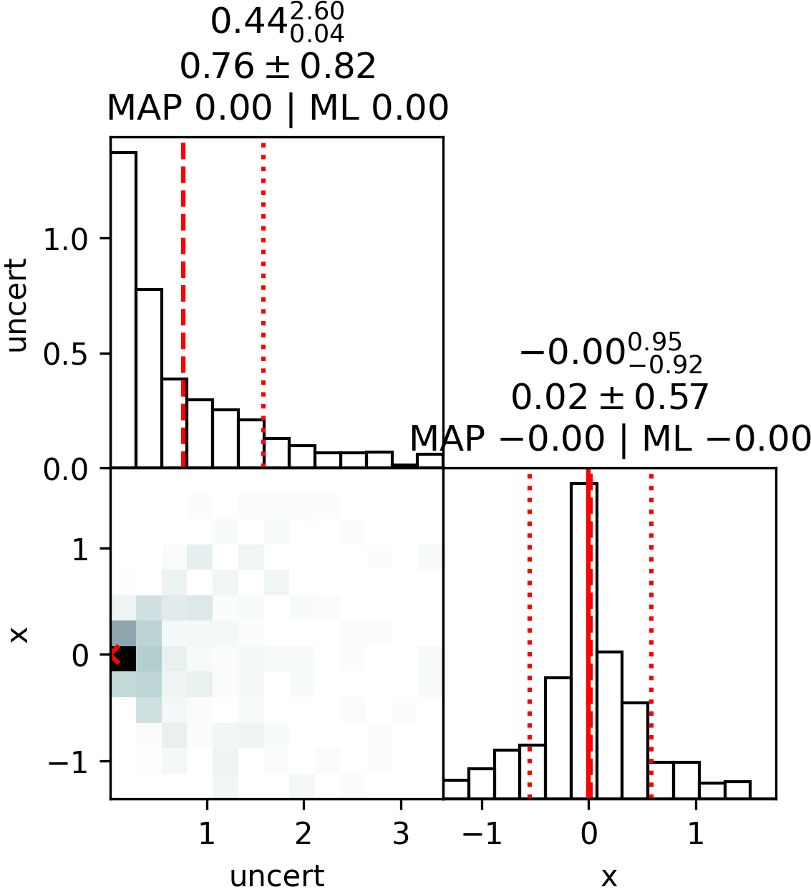

[](https://badge.fury.io/py/jaxns)
[](https://badge.fury.io/py/jaxns)
[](https://jaxns.readthedocs.io/en/latest/?badge=latest)

Main
Status: 

Develop
Status: 


## Mission: _To make nested sampling **faster, easier, and more powerful**_

# What is it?

JAXNS is:

1) a probabilistic programming framework using nested sampling as the engine;
2) coded in JAX in a manner that allows lowering the entire inference algorithm to XLA primitives, which are
   JIT-compiled for high performance;
3) continuously improving on its mission of making nested sampling faster, easier, and more powerful; and
4) citable, use the [(old) pre-print here](https://arxiv.org/abs/2012.15286).

## JAXNS Probabilistic Programming Framework

JAXNS provides a powerful JAX-based probabilistic programming framework, which allows you to define probabilistic
models easily, and use them for advanced purposes. Probabilistic models can have both Bayesian and parameterised
variables.
Bayesian variables are random variables, and are sampled from a prior distribution.
Parameterised variables are point-wise representations of a prior distribution, and are thus not random.
Associated with them is the log-probability of the prior distribution at that point.

Let's break apart an example of a simple probabilistic model. Note, this example can also be followed
in [docs/examples/intro_example.ipynb](docs/examples/intro_example.ipynb).

### Defining a probabilistic model

Prior models are functions that produce generators of `Prior` objects.
The function must eventually return the inputs to the likelihood function.
The returned values of a yielded `Prior` is a simple JAX array, i.e. you can do anything you want to it with JAX ops.
The rules of static programming apply, i.e. you cannot dynamically allocate arrays.

JAXNS makes use of the Tensorflow Probability library for defining prior distributions, thus you can use __almost__
any of the TFP distributions. You can also use any of the TFP bijectors to define transformed distributions.

Distributions do have some requirements to be valid for use in JAXNS.

1. They must have a quantile function, i.e. `dist.quantile(dist.cdf(x)) == x`.
2. They must have a `log_prob` method that returns the log-probability of the distribution at a given value.

Most of the TFP distributions satisfy these requirements.

JAXNS has some special priors defined that can't be defined from TFP, see `jaxns.framework.special_priors`. You can
always request more if you need them.

Prior variables __may__ be named but don't have to be. If they are named then they can be collected later via a
transformation, otherwise they are deemed hidden variables.

The output values of prior models are the inputs to the likelihood function. They can be PyTree's,
e.g. `typing.NamedTuple`'s.

Finally, priors can become point-wise estimates of the prior distribution, by calling `parametrised()`. This turns a
Bayesian variable into a parameterised variable, e.g. one which can be used in optimisation.

```python
import jax
import tensorflow_probability.substrates.jax as tfp

tfpd = tfp.distributions

from jaxns.framework.model import Model
from jaxns.framework.prior import Prior


def prior_model():
    mu = yield Prior(tfpd.Normal(loc=0., scale=1.))
    # Let's make sigma a parameterised variable
    sigma = yield Prior(tfpd.Exponential(rate=1.), name='sigma').parametrised()
    x = yield Prior(tfpd.Cauchy(loc=mu, scale=sigma), name='x')
    uncert = yield Prior(tfpd.Exponential(rate=1.), name='uncert')
    return x, uncert


def log_likelihood(x, uncert):
    return tfpd.Normal(loc=0., scale=uncert).log_prob(x)


model = Model(prior_model=prior_model, log_likelihood=log_likelihood)

# You can sanity check the model (always a good idea when exploring)
model.sanity_check(key=jax.random.PRNGKey(0), S=100)

# The size of the Bayesian part of the prior space is `model.U_ndims`.
```

### Sampling and transforming variables

There are two spaces of samples:

1. U-space: samples in base measure space, and is dimensionless, or rather has units of probability.
2. X-space: samples in the space of the model, and has units of the prior variable.

```python
# Sample the prior in U-space (base measure)
U = model.sample_U(key=jax.random.PRNGKey(0))
# Transform to X-space
X = model.transform(U=U)
# Only named Bayesian prior variables are returned, the rest are treated as hidden variables.
assert set(X.keys()) == {'x', 'uncert'}

# Get the return value of the prior model, i.e. the input to the likelihood
x_sample, uncert_sample = model.prepare_input(U=U)
```

### Computing log-probabilities

All computations are based on the U-space variables.

```python
# Evaluate different parts of the model
log_prob_prior = model.log_prob_prior(U)
log_prob_likelihood = model.log_prob_likelihood(U, allow_nan=False)
log_prob_joint = model.log_prob_joint(U, allow_nan=False)
```

### Computing gradients of the joint probability w.r.t. parameters

```python
init_params = model.params


def log_prob_joint_fn(params, U):
    # Calling model with params returns a new model with the params set
    return model(params).log_prob_joint(U, allow_nan=False)


value, grad = jax.value_and_grad(log_prob_joint_fn)(init_params, U)
```

## Nested Sampling Engine

Given a probabilistic model, JAXNS can perform nested sampling on it. This allows computing the Bayesian evidence and
posterior samples.

```python
from jaxns import DefaultNestedSampler

ns = DefaultNestedSampler(model=model, max_samples=1e5)

# Run the sampler
termination_reason, state = ns(jax.random.PRNGKey(42))
# Get the results
results = ns.to_results(termination_reason=termination_reason, state=state)
```

#### To AOT or JIT-compile the sampler

```python
# Ahead of time compilation (sometimes useful)
ns_aot = jax.jit(ns).lower(jax.random.PRNGKey(42)).compile()

# Just-in-time compilation (usually useful)
ns_jit = jax.jit(ns)
```

You can inspect the results, and plot them.

```python
from jaxns import summary, plot_diagnostics, plot_cornerplot, save_results, load_results

# Optionally save the results to file
save_results(results, 'results.json')
# To load the results back use this
results = load_results('results.json')

summary(results)
plot_diagnostics(results)
plot_cornerplot(results)
```

Output:

```
--------
Termination Conditions:
Small remaining evidence
--------
likelihood evals: 149918
samples: 3780
phantom samples: 1710
likelihood evals / sample: 39.7
phantom fraction (%): 45.2%
--------
logZ=-1.65 +- 0.15
H=-1.13
ESS=132
--------
uncert: mean +- std.dev. | 10%ile / 50%ile / 90%ile | MAP est. | max(L) est.
uncert: 0.68 +- 0.58 | 0.13 / 0.48 / 1.37 | 0.0 | 0.0
--------
x: mean +- std.dev. | 10%ile / 50%ile / 90%ile | MAP est. | max(L) est.
x: 0.07 +- 0.62 | -0.57 / 0.06 / 0.73 | 0.0 | 0.0
--------
```




### Using the posterior samples

Nested sampling produces weighted posterior samples. To use for most use cases, you can simply resample (with
replacement).

```python
from jaxns import resample

samples = resample(
    key=jax.random.PRNGKey(0),
    samples=results.samples,
    log_weights=results.log_dp_mean,
    S=1000,
    replace=True
)
```

### Maximising the evidence

The Bayesian evidence is the ultimate model selection density, and choosing a model that maximises the evidence is
the best way to select a model. We can use the evidence maximisation algorithm to optimise the parametrised variables
of the model, in the manner that maximises the evidence. Below `EvidenceMaximisation` does this for the model we defined
above, where the parametrised variables are
automatically constrained to be in the right range, and numerical stability is ensured with proper scaling.

We see that the evidence maximisation chooses a `sigma` the is very small.

```python
from jaxns.experimental import EvidenceMaximisation

# Let's train the sigma parameter to maximise the evidence

em = EvidenceMaximisation(model, ns_kwargs=dict(max_samples=1e4))
results, params = em.train(num_steps=5)

summary(results, with_parametrised=True)
```

Output:

```
--------
Termination Conditions:
Small remaining evidence
--------
likelihood evals: 72466
samples: 1440
phantom samples: 0
likelihood evals / sample: 50.3
phantom fraction (%): 0.0%
--------
logZ=-1.119 +- 0.098
H=-0.93
ESS=241
--------
sigma: mean +- std.dev. | 10%ile / 50%ile / 90%ile | MAP est. | max(L) est.
sigma: 5.40077599e-05 +- 3.6e-12 | 5.40077563e-05 / 5.40077563e-05 / 5.40077563e-05 | 5.40077563e-05 | 5.40077563e-05
--------
uncert: mean +- std.dev. | 10%ile / 50%ile / 90%ile | MAP est. | max(L) est.
uncert: 0.6 +- 0.54 | 0.05 / 0.45 / 1.37 | 0.0 | 0.0
--------
x: mean +- std.dev. | 10%ile / 50%ile / 90%ile | MAP est. | max(L) est.
x: 0.01 +- 0.56 | -0.6 / -0.0 / 0.69 | 0.0 | -0.0
--------
```

# Documentation

You can read the documentation [here](https://jaxns.readthedocs.io/en/latest/#). In addition, JAXNS is partially
described in the
[original paper](https://arxiv.org/abs/2012.15286), as well as the paper on [Phantom-Powered Nested
Sampling paper](https://arxiv.org/abs/2312.11330).

# Install

**Notes:**

1. JAXNS requires >= Python 3.9. It is always highly recommended to use the latest version of Python.
2. It is always highly recommended to use a unique virtual environment for each project.
   To use **miniconda**, ensure it is installed on your system, then run the following commands:

```bash
# To create a new env, if necessary
conda create -n jaxns_py python=3.11
conda activate jaxns_py
```

## For end users

Install directly from PyPi,

```bash
pip install jaxns
```

## For development

Clone repo `git clone https://www.github.com/JoshuaAlbert/jaxns.git`, and install:

```bash
cd jaxns
pip install -r requirements.txt
pip install -r requirements-tests.txt
pip install -r requirements-examples.txt
pip install .
```

# Getting help and contributing examples

Do you have a neat Bayesian problem, and want to solve it with JAXNS?
I'm really encourage anyone in either the scientific community or industry to get involved and join the discussion
forum.
Please use the [github discussion forum](https://github.com/JoshuaAlbert/jaxns/discussions) for getting help, or
contributing examples/neat use cases.

# Quick start

Checkout the examples [here](https://jaxns.readthedocs.io/en/latest/#).

## Caveats

The caveat is that you need to be able to define your likelihood function with JAX. This is usually no big deal because
JAX is just a replacement for NumPy and many likelihoods can be expressed such.
If you're unfamiliar, take a quick tour of JAX (https://jax.readthedocs.io/en/latest/notebooks/quickstart.html).

# Speed test comparison with other nested sampling packages

JAXNS is really fast because it uses JAX.
JAXNS is much faster than PolyChord, MultiNEST, and dynesty, typically achieving two to three orders of magnitude
improvement in run time, for models with cheap likelihood evaluations.
This is shown in (https://arxiv.org/abs/2012.15286).

Recently JAXNS has implemented Phantom-Powered Nested Sampling, which significantly reduces the number of required
likelihood evaluations for inferring the posterior. This is shown in (https://arxiv.org/abs/2312.11330).

# Note on performance with parallelisation

__Note, that this is an experimental feature.__

If you set `num_parallel_workers > 1` you will use `jax.pmap` under the hood for parallelisation.
This is a very powerful feature, but it is important to understand how it works.
It runs identical copies of the nested sampling algorithm on multiple devices.
There is a two-part stopping condition.
First, each copy goes until the user defined stopping condition is met __per device__.
Then, it performs an all-gather and finds at the highest likelihood contour among all copies, and continues all copies
hit this likelihood contour.
This ensures consistency of depth across all copies.
We then merge the copies and compute the final results.

The algorithm is fairly memory bound, so running parallelisation over multiple CPUs on the same machine may not yield
the expected speed up, and depends on how expensive the likelihood evaluations are. Running over separate physical
devices
is the best way to achieve speed up.

# Change Log

15 May, 2024 -- JAXNS 2.5.0 released. Added ability to handle non-JAX likelihoods, e.g. if you have a simulation
framework with python bindings you can now use it for likelihoods in JAXNS. Small performance improvements.

22 Apr, 2024 -- JAXNS 2.4.13 released. Fixes bug where slice sampling not invariant to monotonic transforms of
likelihood.

20 Mar, 2024 -- JAXNS 2.4.12 released. Minor bug fixes, and readability improvements. Added Empirical special prior.

5 Mar, 2024 -- JAXNS 2.4.11/b released. Add `random_init` to parametrised variables. Enable special priors to be
parametrised.

23 Feb, 2024 -- JAXNS 2.4.10 released. Hotfix for import error.

21 Feb, 2024 -- JAXNS 2.4.9 released. Minor improvements to some priors, and bug fixes.

31 Jan, 2024 -- JAXNS 2.4.8 released. Improved global optimisation performance using gradient slicing.
Improved evidence maximisation.

25 Jan, 2024 -- JAXNS 2.4.6/7 released. Added logging. Use L-BFGS for Evidence Maximisation M-step. Fix bug in finetune.

24 Jan, 2024 -- JAXNS 2.4.5 released. Gradient based finetuning global optimisation using L-BFGS. Added ability to
simulate prior models without bulding model (for data generation.)

15 Jan, 2024 -- JAXNS 2.4.4 released. Fix performance issue for larger `max_samples`. Fixed bug in termination
conditions. Improved parallel performance.

10 Jan, 2024 -- JAXNS 2.4.2/3 released. Another performance boost, and experimental global optimiser.

9 Jan, 2024 -- JAXNS 2.4.1 released. Improve performance slightly for larger `max_samples`, still a performance issue.

8 Jan, 2024 -- JAXNS 2.4.0 released. Python 3.9+ becomes supported. Migrate parametrised models to stable.
All models are now default able to be parametrised, so you can use hk.Parameter anywhere in the model.

21 Dec, 2023 -- JAXNS 2.3.4 released. Correction for ESS and logZ uncert. `parameter_estimation` mode.

20 Dec, 2023 -- JAXNS 2.3.2/3 released. Improved default parameters. `difficult_model` mode. Improve plotting.

18 Dec, 2023 -- JAXNS 2.3.1 released. Paper open science release. Default parameters from paper.

11 Dec, 2023 -- JAXNS 2.3.0 released. Release of Phantom-Powered Nested Sampling algorithm.

5 Oct, 2023 -- JAXNS 2.2.6 released. Minor update to evidence maximisation.

3 Oct, 2023 -- JAXNS 2.2.5 released. Parametrised priors, and evidence maximisation added.

24 Sept, 2023 -- JAXNS 2.2.4 released. Add marginalising from saved U samples.

28 July, 2023 -- JAXNS 2.2.3 released. Bug fix for singular priors.

26 June, 2023 -- JAXNS 2.2.1 released. Multi-ellipsoidal sampler added back in. Adaptive refinement disabled, as a bias
has been detected in it.

15 June, 2023 -- JAXNS 2.2.0 released. Added support to allow TFP bijectors to defined transformed distributions. Other
minor improvements.

15 April, 2023 -- JAXNS 2.1.0 released. pmap used on outer-most loops allowing efficient device-device communication
during parallel runs.

8 March, 2023 -- JAXNS 2.0.1 released. Changed how we're doing annotations to support python 3.8 again.

3 January, 2023 -- JAXNS 2.0 released. Complete overhaul of components. New way to build models.

5 August, 2022 -- JAXNS 1.1.1 released. Pytree shaped priors.

2 June, 2022 -- JAXNS 1.1.0 released. Dynamic sampling takes advantage of adaptive refinement. Parallelisation. Bayesian
opt and global opt modules.

30 May, 2022 -- JAXNS 1.0.1 released. Improvements to speed, parallelisation, and structure of code.

9 April, 2022 -- JAXNS 1.0.0 released. Parallel sampling, dynamic search, and adaptive refinement. Global optimiser
released.

2 Jun, 2021 -- JAXNS 0.0.7 released.

13 May, 2021 -- JAXNS 0.0.6 released.

8 Mar, 2021 -- JAXNS 0.0.5 released.

8 Mar, 2021 -- JAXNS 0.0.4 released.

7 Mar, 2021 -- JAXNS 0.0.3 released.

28 Feb, 2021 -- JAXNS 0.0.2 released.

28 Feb, 2021 -- JAXNS 0.0.1 released.

1 January, 2021 -- Paper submitted

## Star History

<a href="https://star-history.com/#joshuaalbert/jaxns&Date">
  <picture>
    <source media="(prefers-color-scheme: dark)" srcset="https://api.star-history.com/svg?repos=joshuaalbert/jaxns&type=Date&theme=dark" />
    <source media="(prefers-color-scheme: light)" srcset="https://api.star-history.com/svg?repos=joshuaalbert/jaxns&type=Date" />
    
  </picture>
</a>
