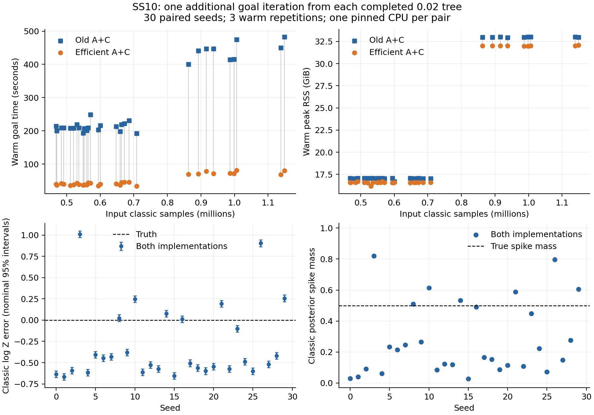

# SS10 0.02: paired complete goal iterations

Completed pairs: 30/30. Every completed pair has identical scientific fields, keys, likelihood counts and classic posterior/evidence accuracy.

Each seed starts from its archived completed 0.02 tree and advances exactly one additional goal iteration (goal_loop_iter increases by one, including any internal allocation rounds). This is not timing from initialization to the uncertainty target. Both implementations run serially on the same pinned CPU, with balanced run order and one cold plus three warm repetitions. Old states use frozen aa79a0d; candidate sampler code is unchanged from 650ae05.

| Capacity | Seeds | Median old s | Median new s | Paired geometric speedup | Median old warm GiB | Median new warm GiB |
|---|---:|---:|---:|---:|---:|---:|
| 857,600 | 21 | 208.84 | 39.28 | 5.35x | 17.05 | 16.57 |
| 1,715,200 | 9 | 446.90 | 71.64 | 5.98x | 32.99 | 32.01 |

| Seed | Capacity | Old s | New s | Speedup | Old warm GiB | New warm GiB | Spike mass, both |
|---|---:|---:|---:|---:|---:|---:|---:|
| 0 | 857,600 | 214.33 | 39.77 | 5.39x | 17.06 | 16.58 | 0.029410 |
| 1 | 857,600 | 208.84 | 41.32 | 5.05x | 17.05 | 16.57 | 0.040743 |
| 2 | 857,600 | 209.57 | 38.78 | 5.40x | 17.05 | 16.57 | 0.090560 |
| 3 | 1,715,200 | 483.12 | 80.59 | 5.99x | 32.98 | 32.07 | 0.819069 |
| 4 | 857,600 | 209.33 | 39.34 | 5.32x | 17.07 | 16.68 | 0.060430 |
| 5 | 857,600 | 218.94 | 44.92 | 4.87x | 17.04 | 16.57 | 0.233857 |
| 6 | 857,600 | 213.48 | 40.10 | 5.32x | 17.06 | 16.56 | 0.214561 |
| 7 | 857,600 | 221.58 | 45.18 | 4.90x | 17.08 | 16.59 | 0.245772 |
| 8 | 1,715,200 | 447.45 | 78.66 | 5.69x | 33.03 | 32.02 | 0.510693 |
| 9 | 857,600 | 230.95 | 45.86 | 5.04x | 17.02 | 16.58 | 0.265948 |
| 10 | 1,715,200 | 475.28 | 80.71 | 5.89x | 33.03 | 32.00 | 0.614483 |
| 11 | 857,600 | 219.13 | 42.67 | 5.14x | 17.05 | 16.17 | 0.085347 |
| 12 | 857,600 | 206.85 | 38.03 | 5.44x | 17.06 | 16.58 | 0.122937 |
| 13 | 857,600 | 208.80 | 43.86 | 4.76x | 17.07 | 16.69 | 0.118840 |
| 14 | 1,715,200 | 446.90 | 71.37 | 6.26x | 32.96 | 32.01 | 0.534237 |
| 15 | 857,600 | 199.77 | 36.08 | 5.54x | 17.03 | 16.57 | 0.026633 |
| 16 | 1,715,200 | 441.36 | 70.46 | 6.26x | 32.99 | 32.02 | 0.491595 |
| 17 | 857,600 | 216.07 | 39.28 | 5.50x | 16.68 | 16.57 | 0.165700 |
| 18 | 857,600 | 248.69 | 42.58 | 5.84x | 17.05 | 16.59 | 0.152022 |
| 19 | 857,600 | 207.65 | 37.67 | 5.51x | 17.06 | 16.56 | 0.087626 |
| 20 | 857,600 | 201.18 | 37.77 | 5.33x | 17.02 | 16.58 | 0.114760 |
| 21 | 1,715,200 | 414.79 | 72.58 | 5.72x | 32.99 | 31.99 | 0.588819 |
| 22 | 857,600 | 193.48 | 36.21 | 5.34x | 17.04 | 16.58 | 0.108196 |
| 23 | 1,715,200 | 400.26 | 69.76 | 5.74x | 32.99 | 32.00 | 0.448680 |
| 24 | 857,600 | 198.40 | 36.43 | 5.45x | 17.04 | 16.57 | 0.222207 |
| 25 | 857,600 | 208.13 | 35.66 | 5.84x | 17.05 | 16.57 | 0.072733 |
| 26 | 1,715,200 | 450.50 | 68.65 | 6.56x | 33.00 | 32.03 | 0.797267 |
| 27 | 857,600 | 202.75 | 34.96 | 5.80x | 17.05 | 16.56 | 0.148732 |
| 28 | 857,600 | 192.56 | 33.54 | 5.74x | 17.04 | 16.57 | 0.275549 |
| 29 | 1,715,200 | 415.61 | 71.64 | 5.80x | 33.01 | 31.97 | 0.605283 |

Geometric mean speedup: 5.532x; paired-seed bootstrap 95% interval [5.389, 5.681]. This interval describes variation across the measured pairs; shared-host load changed as workers finished and is not covered as an independent systematic uncertainty.

Classic log-Z bias: -0.290826; RMSE: 0.526080. Spike-mass RMSE: 0.322133. Nominal classic 95% log-Z interval coverage: 0.067.

All 30 completed outputs have reported classic sigma(log Z) <= 0.02. Reaching this stopping threshold does not imply correct mode mass. Mean spike mass is 0.276423.

Truth is log Z = -24.15593480605331 and spike mass = 0.5000077444258325. Posterior accuracy uses classic rows and soft component responsibilities. Phantoms remain seeds/evidence observations, not posterior rows. Accuracy here is after the added goal. The raw JSON also preserves all 30 archived input-tree phantom-prefix analyses; these are not new analyses of the output trees.

Memory is measured resident high-water RSS for each warm goal using the worker's own Linux marker, reset before each timed call. Persistent compilation/allocator buffers remain resident and count. The input snapshot stays reusable throughout the benchmark; this is a different buffer lifetime from a fresh complete run. Fingerprint and posterior-analysis work occurs after each timed call. Use warm_peak_rss_bytes; the legacy total_peak_rss_bytes field is not a lifetime process maximum after marker resets. Cold time and one-time legacy index conversion time are recorded separately. No claim of bounded full-history storage is made.

Matched seed-0 scaling control using the same harness:

| Saved target | Old warm s | New warm s | Speedup | Old warm GiB | New warm GiB | Added likelihood calls, both |
|---|---:|---:|---:|---:|---:|---:|
| 0.05 | 11.28 | 3.13 | 3.60x | 3.14 | 3.08 | 467,738 |
| 0.02 | 214.33 | 39.77 | 5.39x | 17.06 | 16.58 | 1,225,459 |

The deeper goal also adds more samples and likelihood evaluations. The raw time growth therefore mixes increased goal work with increased history size; it is not a pure asymptotic scaling measurement.

