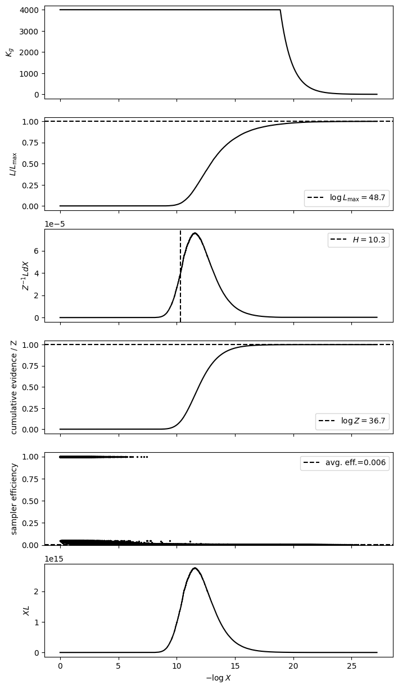

Advanced modelling and run control
==================================

This guide explains how models, optimisation parameters, evidence estimates,
and continuation fit together. The examples use the public JAXNS API. See
:doc:`laptop_to_cluster` for the complete distributed workflow.

Defining a model with realised priors
-------------------------------------

A model is an ordinary Python function that constructs prior variables and
returns **one scalar log-likelihood**. Sum the log densities of conditionally
independent observations. Do not return a vector of per-observation values or
add the sampled variables' prior density to the likelihood: JAXNS already
integrates with respect to that prior.

.. code-block:: python

   import jax
   import jax.numpy as jnp
   import tensorflow_probability.substrates.jax as tfp

   from jaxns.core import NestedSampler
   from jaxns.model import Model
   from jaxns.priors import Prior

   jax.config.update("jax_enable_x64", True)
   tfpd = tfp.distributions

   def prior_model(observations):
       location = Prior(tfpd.Normal(0.0, 1.0), name="location").realise()
       scale = Prior(tfpd.HalfNormal(1.0), name="scale").realise()
       return jnp.sum(tfpd.Normal(location, scale).log_prob(observations))

   observations = jnp.asarray([-0.8, -0.2, 0.1, 0.4, 0.9])
   args = (observations,)
   model = Model(prior_model=prior_model)
   model.sanity_check(jax.random.PRNGKey(0), args=args)

   runner = NestedSampler(model=model, verbose=True)
   state = runner.run(key=jax.random.PRNGKey(1), args=args)
   results = state.to_result().trim()
   results.summary()

Run ``model.sanity_check(...)`` before sampling. It examines raw model outputs
and reports NaNs, positive-infinite log-likelihoods, non-finite prior values,
and non-scalar likelihoods. Normal likelihood evaluation always maps NaN to
``-inf`` (zero likelihood), including at points first visited later in the run.
The sanity check bypasses this conversion so model errors remain visible.
An explicit ``-inf`` log-likelihood is valid. A finite set of checked points
cannot certify the whole prior domain.

``Prior(...)`` describes a distribution. ``realise()`` gives the value to use
in this evaluation of the model, registering its name and the transformation
from a unit-hypercube coordinate to the physical variable. The sampler controls
that coordinate. Re-evaluating a likelihood at the same coordinates does not
make a new independent random draw. You can use one realised value to construct
a later prior, for example a conditional scale or a hierarchical mean.

In v2, the prior model was a generator: ``yield Prior(...)`` handed control to
the model driver, which supplied a value back to the generator. The returned
variables were then passed to a separate likelihood function. In v3,
``realise()`` obtains the value inside a normal function, and that same function
returns the log-likelihood. There is no ``yield`` or separate likelihood
callback to wire up. Use JAX operations in the function so it can be compiled
and batched. Named realised variables appear in ``results.X_samples``.
Give every realised prior a name that is unique within its model scope.

``args`` holds fixed model inputs such as observed data. It is supplied when a
run starts and is stored on its state for continuation. Most models need no
``params`` argument at all. ``run()`` uses the runner's default depth condition.
It does not by itself request a particular evidence uncertainty; a precision
goal is shown below.

Combining optimisation with nested sampling
-------------------------------------------

Use ``realise()`` for a quantity whose uncertainty you want nested sampling to
integrate over. Use ``parameter()`` for a quantity you want to hold fixed during
that integration and update with an optimiser. The current method is
``Prior.parameter()`` (not ``parametrise()``). Its distribution supplies a
constraint-preserving transformation, while ``params`` holds the optimiser's
unconstrained coordinates. Optimise that pytree rather than manually inserting
physical values into it.

For example, integrate over a location while fitting a positive noise scale:

.. code-block:: python

   def conditional_prior_model(observations):
       location = Prior(tfpd.Normal(0.0, 1.0), name="location").realise()
       scale = Prior(
           tfpd.HalfNormal(1.0), name="scale",
       ).parameter(init=1.0)
       return jnp.sum(tfpd.Normal(location, scale).log_prob(observations))

   conditional_model = Model(prior_model=conditional_prior_model)
   params = conditional_model.init_params(jax.random.PRNGKey(2), args=args)
   conditional_runner = NestedSampler(model=conditional_model)

   def conditional_e_step(params, key):
       conditional_state = conditional_runner.run(key=key, args=args, params=params)
       return conditional_state.to_result().trim()

An EM-like outer loop alternates conditional posterior estimation with a
parameter update. In the update below, samples and normalised weights are held
fixed. Only the candidate ``params`` receives gradients:

.. code-block:: python

   def negative_q(candidate_params, fixed_U, fixed_weights, model_args):
       log_likelihoods = jax.vmap(
           lambda u: conditional_model.log_likelihood(
               u, args=model_args, params=candidate_params,
           )
       )(fixed_U)
       return -jnp.sum(fixed_weights * log_likelihoods)

   # Pass the posterior arrays explicitly, so each E-step does not capture a
   # new collection of samples as constants inside a new compiled function.
   value_and_grad = jax.jit(jax.value_and_grad(negative_q))
   for iteration in range(3):
       conditional_results = conditional_e_step(
           params, jax.random.fold_in(jax.random.PRNGKey(3), iteration),
       )
       fixed_U = jax.tree.map(
           jax.lax.stop_gradient, conditional_results.U_samples,
       )
       fixed_weights = jax.lax.stop_gradient(
           jax.nn.softmax(conditional_results.log_dp),
       )

       # A few gradient steps form a generalised M-step. Choose an optimiser
       # and convergence criterion appropriate to your model in a larger fit.
       for _ in range(20):
           objective, gradient = value_and_grad(params, fixed_U, fixed_weights, args)
           params = jax.tree.map(lambda p, g: p - 0.02 * g, params, gradient)
       q = -negative_q(params, fixed_U, fixed_weights, args)
       print(f"Outer iteration {iteration}: fixed-posterior Q = {float(q):.4f}")

   # Refresh the posterior at the final parameter value as well.
   conditional_results = conditional_e_step(params, jax.random.PRNGKey(4))

Here the location prior is independent of the fitted noise scale, so holding
its unit coordinates fixed also holds its physical posterior samples fixed.
If fitted parameters change the latent prior transformation, use fixed physical
samples and the appropriate complete-data log density in the M-step instead.
The example maximises a likelihood objective. A parameter's construction from
a ``Prior`` does not automatically add a regularisation term to that objective.
Add a parameter-prior term explicitly if the intended update is MAP estimation.

Each E-step starts a new run conditional on the updated parameters. Resuming an
old state would reuse its saved parameters, likelihoods, and contours, which
belong to the previous conditional problem. Use separate checkpoint directories
for different parameter values. Monte Carlo E-steps and finite gradient updates
make this an approximate EM-like procedure, without exact monotonicity guarantees.

Selecting a GPU
---------------

Install the appropriate accelerator-enabled JAX build using the
`JAX installation guide <https://docs.jax.dev/en/latest/installation.html>`_.
For a local run, select a device before creating inputs and starting sampling:

.. code-block:: python

   gpu = jax.devices("gpu")[0]
   with jax.default_device(gpu):
       gpu_args = jax.device_put(args, gpu)
       gpu_state = runner.run(
           key=jax.random.PRNGKey(5), args=gpu_args,
       )
       jax.block_until_ready(gpu_state)

``jax.default_device`` selects the default device for JAX operations and
single-device compiled calls. ``device_put`` explicitly moves existing inputs.
When resuming an existing state, move that state to the selected device too.
Keep likelihood operations in JAX so they execute on the device. Plotting and
the Python goal loop still run on the host. See the
`JAX device context documentation <https://docs.jax.dev/en/latest/_autosummary/jax.default_device.html>`_.

Alternatively, select the backend before starting Python. For an NVIDIA setup:

.. code-block:: bash

   JAX_PLATFORMS=cuda python experiment.py

Use the platform matching the installed accelerator build, or
``JAX_PLATFORMS=cpu`` for CPU execution. An explicitly requested backend fails
if it cannot initialise, rather than silently falling back. The first listed
platform is the default when requesting multiple backends. See
`JAX platform configuration <https://docs.jax.dev/en/latest/config_options.html#platforms>`_.

Distributed sampling associates each worker process with a configured platform
and device. That association determines where its likelihood evaluations and
sampling run. Selecting a GPU for the scientific process does not place remote
work on GPUs. See the CPU/GPU worker configuration in :doc:`laptop_to_cluster`.

Reading the diagnostic plot
---------------------------

.. code-block:: python

   results.plot_diagnostics()
   results.plot_cornerplot()

   Diagnostic plot from the executed
   :doc:`Jones calibration example <../examples/Jones_scalar_modelling>`.

All six diagnostic panels share the horizontal coordinate :math:`-\log X`,
where :math:`X` is estimated remaining prior volume. Moving right means deeper
compression into higher-likelihood regions, not later wall-clock time. Rows are
ordered by volume for this plot even when additional sampling was allocated
later to a shallower region.

.. list-table:: Diagnostic panels, from top to bottom
   :header-rows: 1
   :widths: 22 38 40

   * - Panel
     - Quantity
     - How to read it
   * - :math:`K_g`
     - Active lineages crossing each likelihood contour.
     - Shows where the run allocated resolution. It is not worker count or GPU
       batch size. Utility allocation generally gives a varying profile.
   * - :math:`L/L_{\max}`
     - Likelihood relative to the largest value observed.
     - Shows how likelihood rises with compression. The maximum is observed,
       not a proof that the global maximum or every mode was found.
   * - :math:`Z^{-1}L\,dX`
     - Normalised evidence contribution, also the posterior weight per sample.
     - Locates samples important to evidence and posterior expectations. The
       dashed information value :math:`H` is a compression-scale reference.
   * - Cumulative evidence / :math:`Z`
     - Accumulated normalised contributions from left to right.
     - Shows which volume regions carry most of the estimated evidence. It
       reaches one by construction, so this alone does not certify convergence.
   * - Sampler efficiency
     - One divided by likelihood evaluations for each accepted classic sample.
     - Low values identify expensive constrained sampling. The dashed mean is
       classic sample count divided by total likelihood evaluations. This is
       not posterior ESS or elapsed-time efficiency.
   * - :math:`X L`
     - Evidence contribution per unit logarithmic prior-volume interval.
     - Highlights the compressed volume range that carries evidence. Shoulders
       can indicate separate contributions, but are not a count of modes.

The corner plot complements these volume diagnostics with parameter-space
geometry and marginal posterior distributions. Compare independent random seeds
and successively tighter runs when assessing stability. Small reported
uncertainties and a smooth diagnostic plot cannot certify that every relevant
region has been discovered.

Collecting phantoms and conditioning the evidence
-------------------------------------------------

A constrained sampling chain produces intermediate stationary observations as
well as its final classic point. Their likelihoods provide additional
information about the prior-volume compression between contours. Phantom
conditioning uses this information in Monte Carlo evidence draws while keeping
the classic race tree fixed. Observations from one chain are treated as a
cluster, with shared random weighting, rather than as independent replacements.
A participating-cluster threshold limits conditioning where support is sparse.

Enable retention before sampling. This example keeps all intermediate states
of the default slice chain, whose length is five times the model dimension:

.. code-block:: python

   dimension = model.U_ndims(args=args)
   evidence_runner = NestedSampler(
       model=model,
       allocation_target="evidence_improving",
       root_allocation_degree=30 * dimension,
       delta_K=30 * dimension,
       collect_phantom_samples=True,
       max_phantom_samples=5 * dimension - 1,
       unlimited_samples=True,
       verbose=True,
   )
   evidence_state = evidence_runner.run_until_goal(
       goal_cond=lambda state: state.expected_log_Z_uncert <= 0.1,
       args=args,
       key=jax.random.PRNGKey(6),
   )
   evidence_results = evidence_state.to_result().trim()
   classic = evidence_results.sample_evidence(
       512, key=jax.random.PRNGKey(7),
   )
   phantom = evidence_results.sample_evidence(
       512, key=jax.random.PRNGKey(8), phantom_conditioning=True,
   )
   print("Classic MC:", classic.log_Z_mean, classic.log_Z_uncert)
   print("Phantom MC:", phantom.log_Z_mean, phantom.log_Z_uncert)
   evidence_results.plot_evidence(
       num_samples=512, conditionings=("classic", "phantom"),
       key=jax.random.PRNGKey(9),
   )

``sample_evidence`` defaults to classic conditioning. With phantom conditioning,
``num_phantoms=None`` uses all retained states. Without an explicit retention
capacity, the sampler stores only up to one dimension's worth of intermediate
states, rather than the entire chain. A later analysis cannot recover discarded
states. Increasing the number of evidence draws reduces Monte Carlo noise in
the ensemble summary, without adding likelihood observations.

The state properties ``expected_log_Z_mean`` and ``expected_log_Z_uncert`` and
the result fields ``log_Z_mean`` and ``log_Z_uncert`` are classic expectation
estimates. Monte Carlo summaries belong to the returned ``EvidenceSamples``.
Phantom conditioning does not replace the stored posterior samples or weights,
so it does not change corner plots, posterior integration, or classic ESS.

Phantoms can improve evidence accuracy when the classic tree resolves enough
likelihood structure. They cannot supply observations of unvisited regions,
and their reported evidence uncertainties can be overconfident. Compare
classic and phantom estimates without treating a narrower phantom interval as
proof of accuracy. See :doc:`phantom_conditioning` for retention and prefix
selection details.

Combining evidence and posterior allocation
-------------------------------------------

The allocation policy chooses where to spend additional likelihood evaluations.
The depth condition controls how far sampling extends into the likelihood
contours before the Python goal is checked. The goal then decides whether the
whole run has met the requested precision, sample quality, or work budget.

The runner owns a default depth condition of
``DepthCondition(dlogZ=log1p(1e-3))``. This bounds the estimated remaining-evidence
contribution along the expected classic volume path. It is not a target of
0.001 on log-evidence uncertainty. Most users can keep this default and specify
their scientific goal through ``run_until_goal``.

``allocation_target="uniform"`` is the default. It supplies the uniform contour
resolution underlying static nested sampling. Further goal iterations raise
that uniform target. ``"evidence_improving"`` instead directs additional
lineages toward contours expected to reduce evidence uncertainty.
``"posterior_improving"`` directs them toward increasing the Kish effective
sample size of the posterior weights. The latter measures weight balance,
not an autocorrelation-adjusted independent sample count.

``root_allocation_degree`` controls the initial root population. ``delta_K``
controls the amount of added allocation: a uniform target increment for the
uniform policy, or the peak additional allocation for a utility policy.
``replacement_width`` on the local runner and worker batch sizes in a
distributed run control execution parallelism separately from these scientific
budgets. ``unlimited_samples=True`` allows the sample buffers to grow as needed.

A useful sequence is to establish evidence accuracy, inspect the represented
posterior, then request more effective posterior samples. Continue the same
state with a runner using the second allocation policy:

.. code-block:: python

   from dataclasses import replace

   initial_ess = float(evidence_results.ess)
   posterior_runner = replace(
       evidence_runner, allocation_target="posterior_improving",
   )
   posterior_state = posterior_runner.resume_until_goal(
       evidence_state,
       goal_cond=lambda state: state.to_result().ess >= 2.0 * initial_ess,
   )
   posterior_results = posterior_state.to_result().trim()
   print("Classic Kish ESS:", initial_ess, "->", float(posterior_results.ess))
   evidence_results.plot_diagnostics()
   posterior_results.plot_diagnostics()

The ESS goal constructs a result at each completed goal boundary because ESS
is a result property. Evidence-uncertainty goals can read the state directly.
The ``replace`` call preserves sampler configuration and phantom capacity.
Switch policies at a completed goal boundary so any unfinished work first
finishes under its original policy.

In the two diagnostic plots, compare :math:`K_g` over the volume region carrying
posterior mass. Posterior allocation adds resolution there, splitting large
weights across more samples. Individual peaks in the per-sample weight panel
can therefore shrink even when the posterior distribution is stable. The
:math:`XL` and cumulative-evidence profiles should be assessed alongside those
changes. Evidence allocation may spend more work on shallower contours whose
compression uncertainty affects downstream evidence, so its lineage profile
need not peak exactly with the posterior-weight panel.

You can switch back to evidence allocation if a later scientific goal requires
it. These policies add samples to the same run. Neither a larger ESS nor an
allocation switch establishes that missing likelihood structure has been found.

Pause, inspect, and resume with a new goal
------------------------------------------

Save the full state when you want to continue sampling. A result object is for
analysis and does not contain the complete continuation. For example, save the
evidence phase above, inspect it, then request a tighter precision:

.. code-block:: python

   from jaxns.state import State

   evidence_state.save("evidence-state.pkl")
   saved = State.load("evidence-state.pkl")
   refined = evidence_runner.resume_until_goal(
       saved,
       goal_cond=lambda state: state.expected_log_Z_uncert <= 0.05,
       checkpoint_dir="checkpoints/refined-evidence",
       checkpoint_cadence=60.0,
   )
   refined_results = refined.to_result().trim()
   refined_results.summary()

A checkpoint directory enables automatic saves and automatic continuation on
the next invocation. An existing checkpoint takes precedence over a supplied
state, key, or new-run ``args`` and ``params``. Use a separate directory for each
independent experiment or branch of an analysis. Keep the model definition
available when loading saved states in another process.

For an interactive pause at the next complete goal boundary, include a stop
file in the goal:

.. code-block:: python

   from pathlib import Path

   def precision_or_pause(state):
       return (
           Path("PAUSE").exists()
           or state.expected_log_Z_uncert <= 0.025
       )

   paused_or_finished = evidence_runner.resume_until_goal(
       refined,
       goal_cond=precision_or_pause,
       checkpoint_dir="checkpoints/interactive-evidence",
       checkpoint_cadence=60.0,
   )
   paused_or_finished.save("interactive-state.pkl")

Create ``PAUSE`` from another terminal with ``touch PAUSE``. After the call
returns, inspect its result, remove ``PAUSE``, and resume with the same or a new
goal. For a time budget, a Python goal can likewise compare a monotonic clock
with a deadline. Goals are checked only at completed depth boundaries, so they
are not precise wall-clock deadlines.

With checkpointing enabled, Ctrl-C saves the latest coherent continuation and
then raises ``KeyboardInterrupt``. Local saving waits for a safe compiled-batch
boundary. Resume a partially completed depth with the same sampling settings
before changing its allocation policy. Without checkpointing, Ctrl-C propagates
without saving. Distributed interruption also cancels that session's outstanding
work safely; :doc:`laptop_to_cluster` explains worker cleanup and resumption.

An incremental workflow lets you compare evidence, posterior moments, and mode
weights after each additional budget, then decide whether the next phase should
improve evidence precision or posterior resolution. Independent restarts provide
a complementary check on sensitivity to initial exploration. Treat stopping
uncertainty as an estimate conditional on the structure represented in the run.
